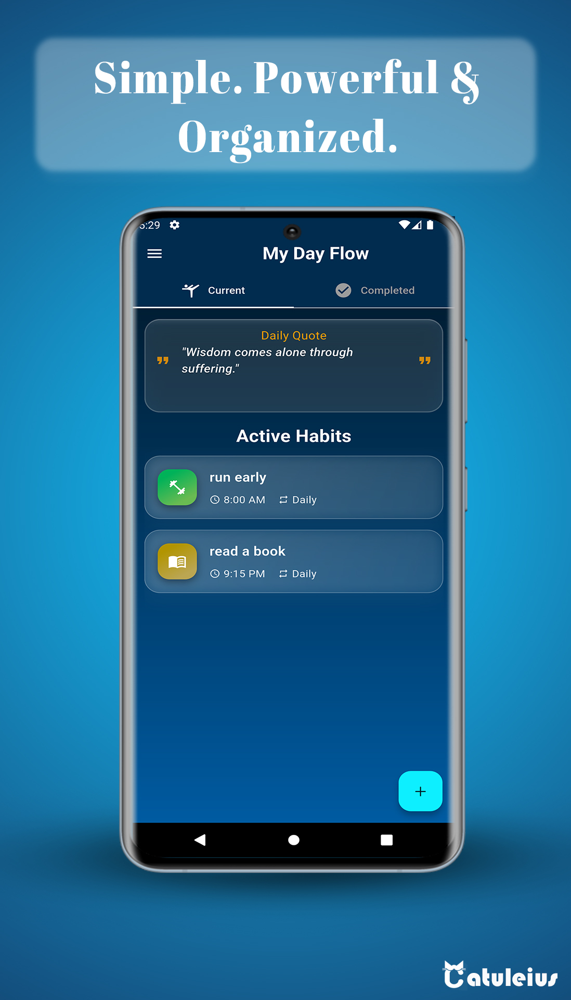
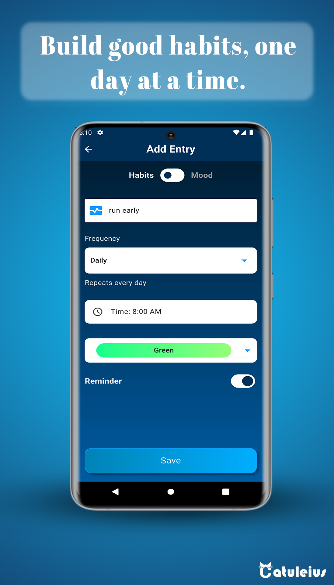
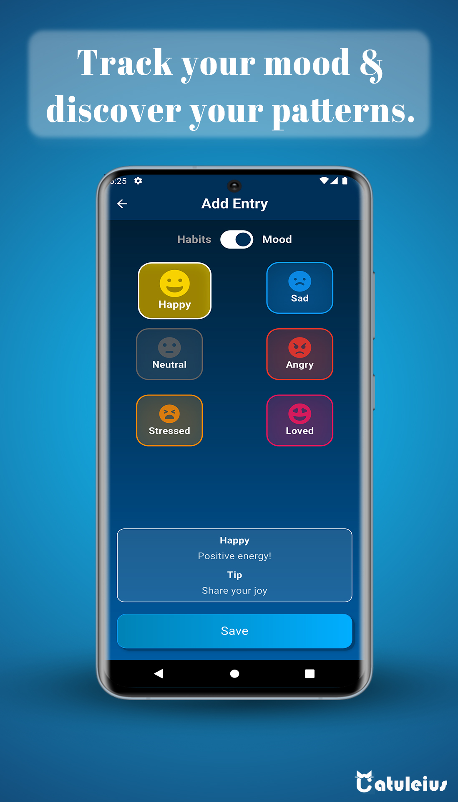
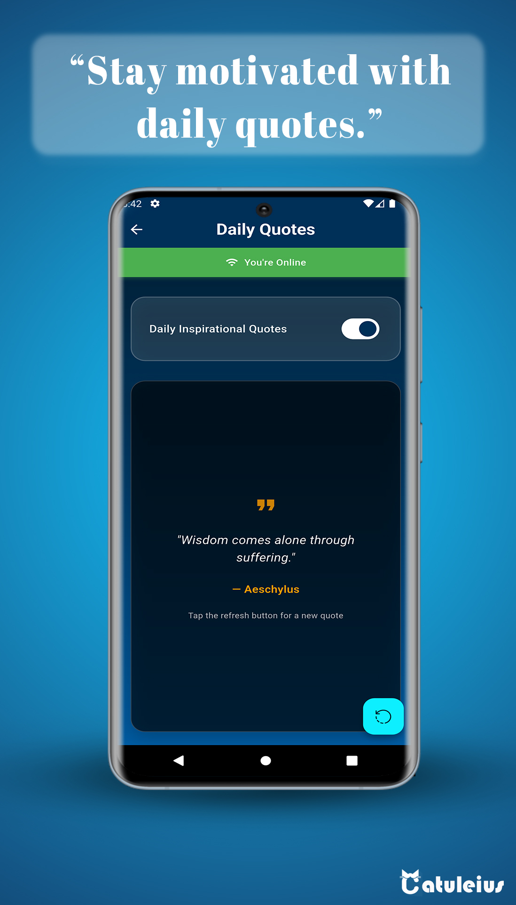
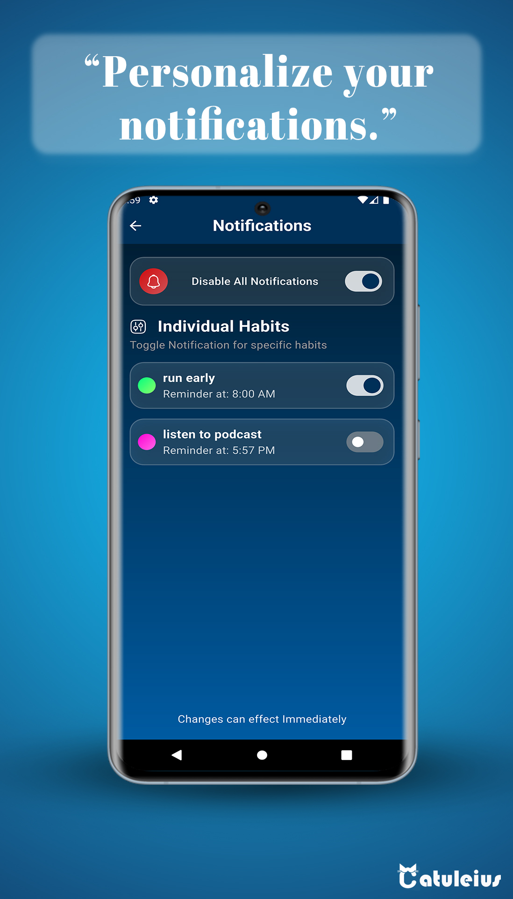

## 📱 My Day Flow

# 📱 My Day Flow

My Day Flow is a mobile application built with **Flutter** that helps users build healthy routines, track their mood, and stay motivated throughout the day.  

This project was developed as part of the **IBM Android and iOS Mobile Development Capstone**, but goes beyond the requirements by incorporating professional Flutter practices and additional features. The app is also published on the Google Play Store, making it a real-world, production-ready project.

---

## ✨ Features

- ✅ Track daily habits  
- ✅ Monitor mood patterns  
- ✅ Store personal data and preferences locally (**offline-first**)  
- ✅ Receive inspirational quotes (when online)  
- ✅ Schedule daily reminders and motivational notifications  

---

## 🛠️ Technologies & Tools

- **Flutter** – Cross-platform mobile app framework  
- **GetX** – State management and dependency injection  
- **Hive** – Local NoSQL database for fast offline storage  
- **SharedPreferences** – Lightweight key-value persistence  
- **Flutter Local Notifications** – Scheduling reminders and notifications  
- **Figma** – UI/UX design mockups and wireframes  
- **Git & GitHub** – Version control and collaboration  

---

## 📐 Planning & Design Process

I approached this project using **Agile methodology** with clearly defined user stories and iterative development.

### 1. Design Mockups
I then moved to high-fidelity mockups in **Figma**, refining the visual style, colors, and typography.  

(screenshots/figma-design.JPG)

### 3. Project Architecture Pattern
For scalability and maintainability, I applied a clean project architecture pattern with separation of concerns between UI, state management, and data layers.  

👉 *(Insert your project pattern/architecture screenshot here)*

---

## 🚀 Development Approach

While the capstone only required basic functionality, I intentionally went further to create a **portfolio-grade application**:

- Implemented **GetX** for clean and reactive state management  
- Added both **Hive** and **SharedPreferences** for robust data persistence  
- Integrated **external APIs** for motivational quotes  
- Documented the codebase with comments for maintainability  
- Ensured **dark mode support** and a polished UI experience  

---

## 📲 Publishing

The application is published on the **Google Play Store**.  

👉 [Download My Day Flow on Google Play](#) *(Insert actual link when available)*

---

## 📸 Screenshots

| Home Screen | Habit Tracker | Mood Tracker | Quotes |Notifications|
|-------------|---------------|--------------|--------|--------|
|  |  |  |  |  |

---

## 📖 User Stories

The app was developed based on 9 user stories.  
👉 

---

## 🏆 Reflection

This project not only fulfills the requirements of the **IBM Mobile Development Capstone**, but also demonstrates my ability as a **Flutter developer** to:  

- Plan, design, and implement a complete mobile app from scratch  
- Use **clean architecture** and professional coding practices  
- Integrate APIs, local databases, and notifications  
- Deploy an application to the Google Play Store  

I went beyond the expectations of the course to make this app **portfolio-ready** and to showcase my skills as a mobile developer.  

---

## 📬 Contact

Created with ❤️ by SALIM SOLTANI **[Catuleius ]**  
- GitHub: [SALIM SOLTANI](https://github.com/salimsoltani41)  
- LinkedIn: [YourLinkedInProfile](#)  
- Email: contact@catuleius.com  
